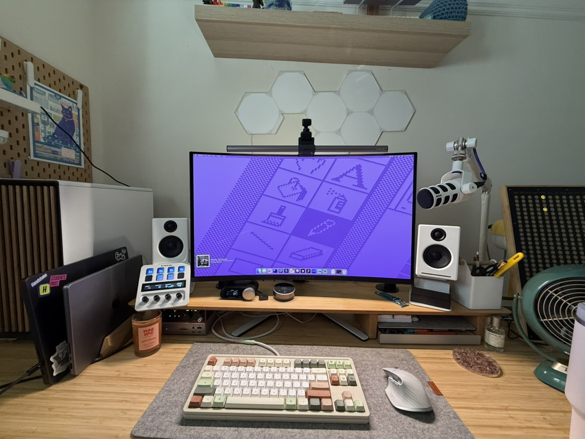

## Mon bureau

### Matériel

- **Mac perso :** Macbook Pro 14"
  - Processeur M2 Max
  - 32 Go de RAM
  - 1 To de stockage SSD
- **Mac du boulot :** Macbook Pro 16"
  - Fourni par l'entreprise
  - M4 Ultra
  - 64 Go de RAM
- **PC de jeu :** montage maison
  - Configuration détaillée sur [PC Part Picker](https://pcpartpicker.com/user/angrywobbles/saved/#view=r6GF4D)
- [Écran Alienware 4k QD-OLED 32"](https://www.dell.com/en-us/shop/alienware-32-4k-qd-oled-gaming-monitor-aw3225qf/apd/210-blmq/monitors-monitor-accessories)
  - J'utilisais avant un Apple Studio Display, que je vais sans doute revendre. C'est un magnifique écran, mais l'absence de prise en charge d'autres sources d'entrée a fini par être beaucoup trop limitante pour moi. Plutôt que de bricoler une usine à gaz pour y brancher mon PC de jeu, j'ai opté pour un _excellent_ écran PC, et le Studio Display ne me manque pas du tout.
- [BenQ Screenbar Halo](https://www.benq.com/en-us/lighting/monitor-light/screenbar-halo.html)
  - Les barres lumineuses au-dessus des écrans, c'est le genre de truc dont on ne pense jamais avoir besoin… jusqu'à ce qu'on en ait une, et là, impossible d'imaginer s'en passer. Il en existe plein de très bonnes ; j'aime bien celle-ci parce que le boîtier de commande est sans fil.
- [Webcam Insta360 Link](https://www.insta360.com/product/insta360-link)
- [Enceintes de bureau AudioEngine A2+](https://audioengine.com/shop/wirelessspeakers/a2-wireless-computer-speakers/)
- [Station d'accueil Thunderbolt Caldigit TS4](https://www.caldigit.com/thunderbolt-station-4/)
- [Interface audio Focusrite Scarlett Solo](https://focusrite.com/products/scarlett-solo)
- [Microphone XLR RØDE PodMic (blanc) avec bras articulé RØDE](https://rode.com/en-us/microphones/broadcast/podmic?variant_sku=PODMICW)
- [Clavier Mode Loop TKL (coloris Penrose)](https://modedesigns.com/pages/loop-tkl) avec [touches Osume Zen](https://osume.com/products/zen-keycaps-marshmallow)
  - Les claviers mécaniques sont un peu devenus une obsession de confinement pour ma partenaire et moi. Celui-ci reste mon clavier du quotidien, mais un de ces jours, je publierai un article détaillant toute ma collection.
- [Souris Logitech MX Master 3s](https://www.logitech.com/en-us/shop/p/mx-master-3s.910-006558)

### Logiciels

#### Applications principales

- Éditeur de code : [Cursor](https://www.cursor.com)
- Gestionnaire de tâches : [Things 3](https://culturedcode.com/things/)
- Rédaction : [iA writer](https://ia.net/writer)
- Notes : [Obsidian](https://obsidian.md)
- Émulateur de terminal : [Ghostty](https://ghostty.org)
- Agenda : [Fantastical](https://flexibits.com/fantastical)
- E-mail : Apple Mail et Fastmail

#### Utilitaires

- [Raycast](https://www.raycast.com) comme lanceur, calculatrice et bien plus encore
- [Bartender](https://www.macbartender.com/Bartender4/) pour gérer ma barre de menus
- [CARROT](https://www.meetcarrot.com/weather/) pour consulter la météo

## En déplacement

### Tech

_Comme vous l'avez sans doute deviné, je suis à fond dans l'écosystème Apple. Pour moi, ça marche exactement comme je veux que mon matos marche, et j'adore la fluidité avec laquelle des trucs comme les AirPods et les AirTags se marient avec mon téléphone, ma tablette et mon Mac_

- **Téléphone :** iPhone 16 Pro Max
- **Tablette principale :** iPad Pro M4 avec Magic Keyboard et Apple Pencil Pro
- [Liseuse Kobo Libra 2](https://us.kobobooks.com/products/kobo-libra-2)
  - J'ai eu une liseuse Kindle avant, et je l'aimais beaucoup, mais je n'aime pas à quel point Amazon a verrouillé son écosystème, et je préfère l'ergonomie de la Kobo Libra. Pour moi, les boutons physiques pour tourner les pages sont indispensables.
- Écouteurs intra-auriculaires AirPods Pro 2
- Casque circum-auriculaire AirPods Max

### Photographie

- [Appareil photo numérique Fujifilm X100 VI](https://www.fujifilm-x.com/en-us/products/cameras/x100vi/)

La photographie est un nouveau loisir pour moi, et je trouve peu à peu mes repères. J’ai choisi le X100 VI en partie parce que j’adore son esthétique, mais surtout pour sa taille et sa simplicité. Il est assez petit pour que je puisse l’emporter dans mon sac à main ou la poche de ma veste, et l’absence d’objectifs
interchangeables est en fait un avantage pour moi, car cela m’incite à me concentrer sur les bases du cadrage plutôt que de chercher à utiliser l’objectif parfait. Mon Fuji est parfait pour la photographie de rue, les photos spontanées de proches et l’usage quotidien.

### Sacs

_Je suis un peu maniaque des sacs et j'en change bien plus souvent qu'une personne saine d'esprit ne le devrait. Voici ma rotation du moment_

- **Sac à dos de travail :** [Bellroy Tokyo Totepack](https://bellroy.com/products/tokyo-totepack?color=deep_plum\&material=baida_ripstop\&size=15in#slide-0)
- **Sac de week-end :** [Tom Bihn Maker's Bag](https://www.tombihn.com/products/the-makers-bag?variant=43536926671037)
- **Sac à main :** [Bellroy Tokyo Crossbody](https://bellroy.com/products/tokyo-crossbody?color=deep_plum\&material=baida_ripstop#slide-0)
- **Sac de sport :** [Aer Gym Duffle 3](https://aersf.com/collections/duffels/products/gym-duffel-3?country=US)

Pour moi, le sac à dos de travail est réservé à mon boulot. Je ne m'en sers pratiquement que pour les trajets aller-retour au bureau. Le Tokyo Totepack a la taille parfaite pour mon ordinateur portable pro de 16" et mes accessoires essentiels (parapluie, chargeurs, petite trousse de cosmétiques, etc.).

Mon « sac de week-end », c'est celui que j'emporte lors de mes escapades urbaines en dehors du travail. Idéal pour y glisser mon iPad, un livre ou ma liseuse, de l'eau et mon appareil photo.